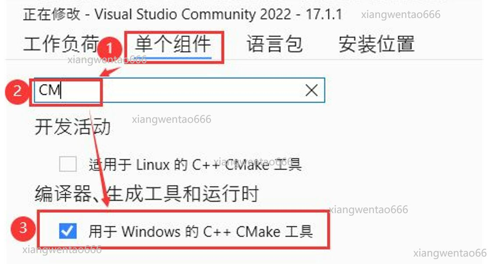
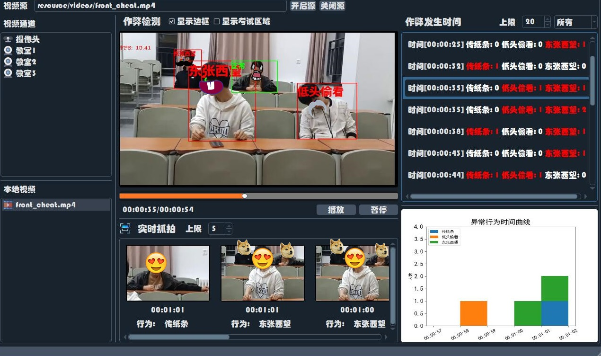
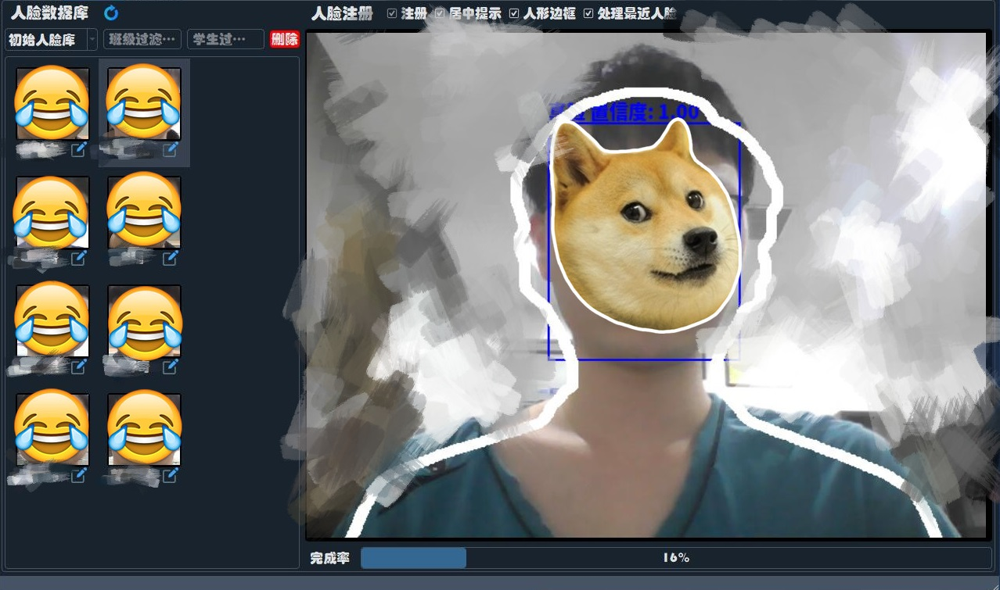
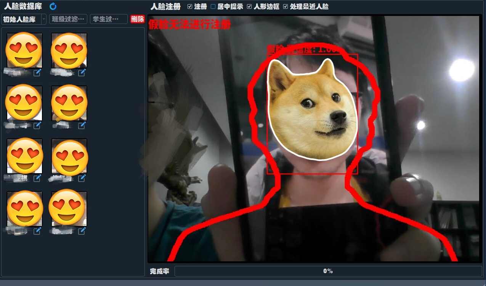
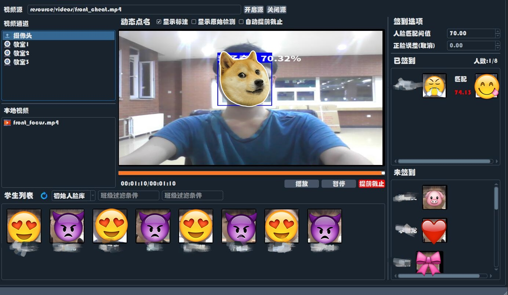

# 智慧教室Demo

群体课堂专注度分析、考试作弊系统、动态点名功能的Qt Demo，使用多人姿态估计、情绪识别、人脸识别、静默活体检测等技术

[相关项目](https://github.com/hongyaohongyao/smart_classroom) 

## 项目环境

- Python 3.7
- PyQt5
- Pytorch1.8.1
- 更多可参考requirements.txt文件
- 人脸识别功能要使用gpu需要自己[编译gpu版的dlib](https://blog.csdn.net/qq_29168809/article/details/102655115) 
- 最好用有gpu的设备运行嗷，没有gpu可能需要自己在项目里改

## 使用步骤
### 1. 配置环境（欢迎大家在试错并且配置成功后把这篇文档没有覆盖到的bug这些都补充一下下哈！众人拾柴速度快（×）火焰高（√）哈哈哈哈！谢谢大家！）

**一些积累下来的报错和基本的解决方法可以[按住Ctrl键再点我跳转到对应页面](https://github.com/hongyaohongyao/smart_classroom_demo/issues/17)慢慢食用哦！**

- 安装VisualStudio，注意在Installer中勾选“单个组件”中的“用于Windows的C++ CMake工具”然后再安装，就像下图这样的：

- 安装Anaconda
- 在Anaconda中创建虚拟Python环境，版本是3.7
- 在虚拟Python环境中安装cmake，运行如下指令：
```
pip install cmake
```
- 在虚拟Python环境中安装boost，运行如下指令：
```
pip install boost
```
- 安装项目工程根目录下的requirements.txt文件所指定的包，运行如下指令

（%REQUIREMENTS_PATH% 表示requirements.txt所在的文件夹的路径，比如requirements.txt在电脑中的绝对路径为：E:\Data\requirements.txt，则指令中的%REQUIREMENTS_PATH%就为：E:\Data，**注意斜线是用  \  还是  /  需要根据系统不同进行区分哈**！）：
```
pip install -r %REQUIREMENTS_PATH%\requirements.txt
```
_如果最终运行smart_classroom_app.py不成功，报错和某些包有关，记得和requirements.txt文件中的模块一个个比对，将同名的包一个个删掉再安装相同的版本。之后再试着运行smart_classroom_app.py文件_
- 上pytorch官网的[下载页面](https://download.pytorch.org/whl/cu113/torch_stable.html)根据自己的机器配置找对应pytorch的安装指令，比如如下的指令：
```
pip3 install torch==1.11.0+cu113 torchvision==0.12.0+cu113 torchaudio===0.11.0+cu113 -f 
```

### 2.下载权重文件

从[百度云（提取码：uk26）](https://pan.baidu.com/s/16av6CXWrCgGkniCwCc3qqQ) 下载smart_classroom_demo项目的权重文件放置到weights文件夹下。

### 3.运行smart_classroom_app.py

## 界面展示

### 作弊检测

视频是实时检测和播放的，可以选择视频文件或rtsp视频流作为视频源，视频通道下摄像头以外的选项在resource/video_sources.csv文件里设置。



### 人脸注册



静默活体检测，照片不能用来注册



### 动态点名

学生面向摄像头完成签到，可以多人同时进行签到


